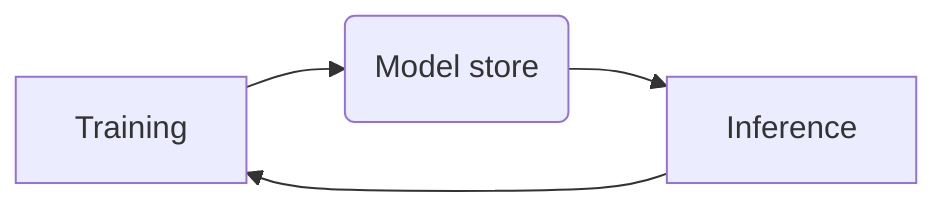

# FindHotel's Machine Learning Engineer assignment

## Introduction

This assignment is part of the recruitment process of Machine Learning Engineers here at FindHotel.
The purpose is to asses the technical skills of our candidatess in a generic scenario, similar to the one they would experience at FindHotel.

> **_NOTE_**: Please, read carefully all the instructions before starting to work on your solution and feel free to contact us if you have any questions.

## Repository content

The content of this repository is organised as follows:
- Root directory including:
  - [Dockerfile](Dockerfile) used to build the `client` docker image for the assignment.
  - [docker-compose](docker-compose.yaml) file used to launch the `localstack` and  `ofelia` orchestration docker containers and any other container needed to complete the assignment
  - [Makefile](Makefile) used in the `ofelia` orchestration docker container and that should be used to execute all the necessary steps of the assignment.
  - [requirments.txt](requirements.txt) contains the python packages for the assignment to run.
- [aws](aws/) directory including a credentials file that allows connecting from the `client` docker container to the `localstack` docker container using the AWS CLI.
- [deployment](deployment/) directory including a sample Terraform script that deploys a S3 bucket (optionally for model storage).
- [lambda](lambda/) directory including a `test` Python script for a sample Lambda function.
- [codes](codes/) directory includes sample training and inference code that could be used in the pipeline
- [data](data/) directory includes some generated data that can be used to build a model, the data was automatically generated with the script in [bin](codes/bin/)

## Environment

The default configuration in this repository will create three Docker images:
- `localstack`:
  - Uses the [localstack](https://hub.docker.com/r/localstack/localstack) Docker image
  - [LocalStack](https://docs.localstack.cloud) is a local and limited emulation of AWS, which allows deploying a subset of the AWS resources.
  - It will be used to deploy a simple data infrastructure and run the assignment tasks.
  - This container should be used as is.
- `init_resources`
  - Uses a custom Docker image defined in the [Dockerfile](Dockerfile) and it is based on Ubuntu 20.04.
  - It is the basis for the entire application, it builds the docker image that has the training and inference pipeine
  - It is used to interact with the `localstack` container (in case you decide to use some s3 resources)
  - It has some tools pre-installed (Terraform, AWS CLI, Python, etc.).
  - This container and/or its components can (and should) be modified in order to complete the assignment.
- `ofelia`
  - This is the scheduling container for the assignment
  - In this container you are really more concerned to change the schedule and/or commands as you see fit.
  - You can read more about ofelia [here](https://github.com/mcuadros/ofelia)

## Quick start

Follow this steps to get your environment ready for the assignment

1) Fork this repository and clone it in your computer.

2) Install [Docker](https://docs.docker.com/get-docker/).

3) Go to the root folder of the project and execute the following command to create the Docker images and run the containers:

```bash
$ cd ml-engineer-assignment
$ docker-compose up
```

4) You will be working mostly with the image build with the `init_resource` task in the docker-compose. Whenever you change anything, it is recommended to remove the existing container and image to ensure the latest version is used. You can do this with:

```bash
$ stop docker-compose with cmd/ctrl c
$ docker-compose down 
```


## Assignment

In this assignment you will be working with internal data from two data sources.

The overal purpose is to prepare a scalable end to end machine learning pipeline that our data scientist can easily plugin in and update given some training files and some inference python file.

We want you to be able to use any orchestration tool of choice (but we would favour Metaflow)

The assignment is divided in 2 parts, the first one focused on end to end training to batch inference. The second part is mainly focused on how you would monitor the model relative to business and model metrics such that we have a model that keep performing since the model is going to be mission critical.

>**_NOTE_**: The environment that we provide for the assignment and the examples in it use Docker-compose and Terraform to create the infrastructure and Python for most other things.
However, you are free to choose your own tools for this assignment.
Just remember that, in that case, you may need to install other tools you will need to update the docker compose to reflect your tools and resources.

### Part 1 - Create an end to end pipeline for inference on the training script

In this first part of the assignment the objective is to go from the training code and model to inference.


>**_NOTE:_** We are particular about this cycle in the context of batch inference.


### Part 2 - Add metrics measuring for circuit breaking the model in production environment

In this part of the assignment you will help business stakeholders and users of your model's inference to have high level of confidence in your model by providing some monitoring environment for evaluating your model and determining when there is an emergency. You can use any tool of choice here that can interact with your enviornment


### Bonus - Evaluate how to go from data scientist's training and inference code update to deploying new version of the model.

## Evaluation

We expect the solution to be self-contained, as the sample infrastructure provided.
Therefore, we will test your solution by running:

```bash
$ docker-compose up
```

> **_NOTE_**: We suggest using the Makefile to run all the necessary steps in the `ofelia` orchestration container, like we do in the sample. However, you are free to do it any way you want, as long as everything that needs to run does so automatically when the containers are launched.

We will also check all the code provided in the repository and evaluate it focusing on:
- Code quality
- Best practices
- Architectural design
- Scalability
- Testing

## References

- [LocalStack docs](https://docs.localstack.cloud/overview/)
- [Terraform docs](https://www.terraform.io/docs)
- [Terraform AWS provider docs](https://registry.terraform.io/providers/hashicorp/aws/latest)
- [AWS CLI docs](https://docs.aws.amazon.com/cli/latest/index.html)
- [AWS Python SDK docs](https://boto3.amazonaws.com/v1/documentation/api/latest/index.html)
- [Ofelia](https://github.com/mcuadros/ofelia)